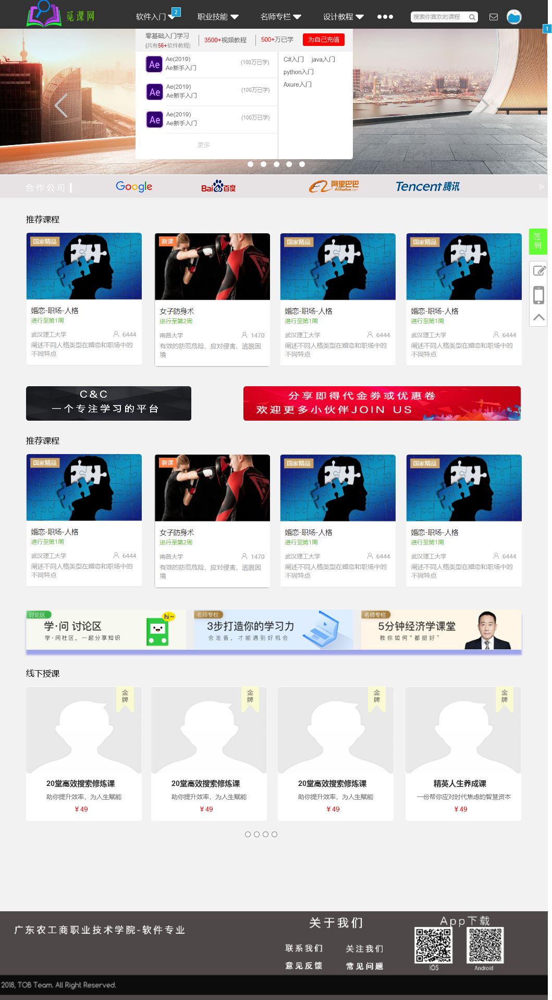
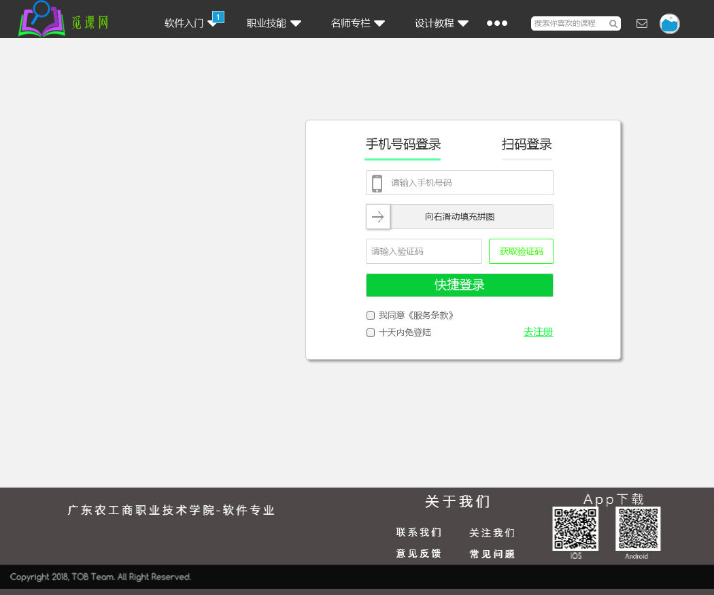
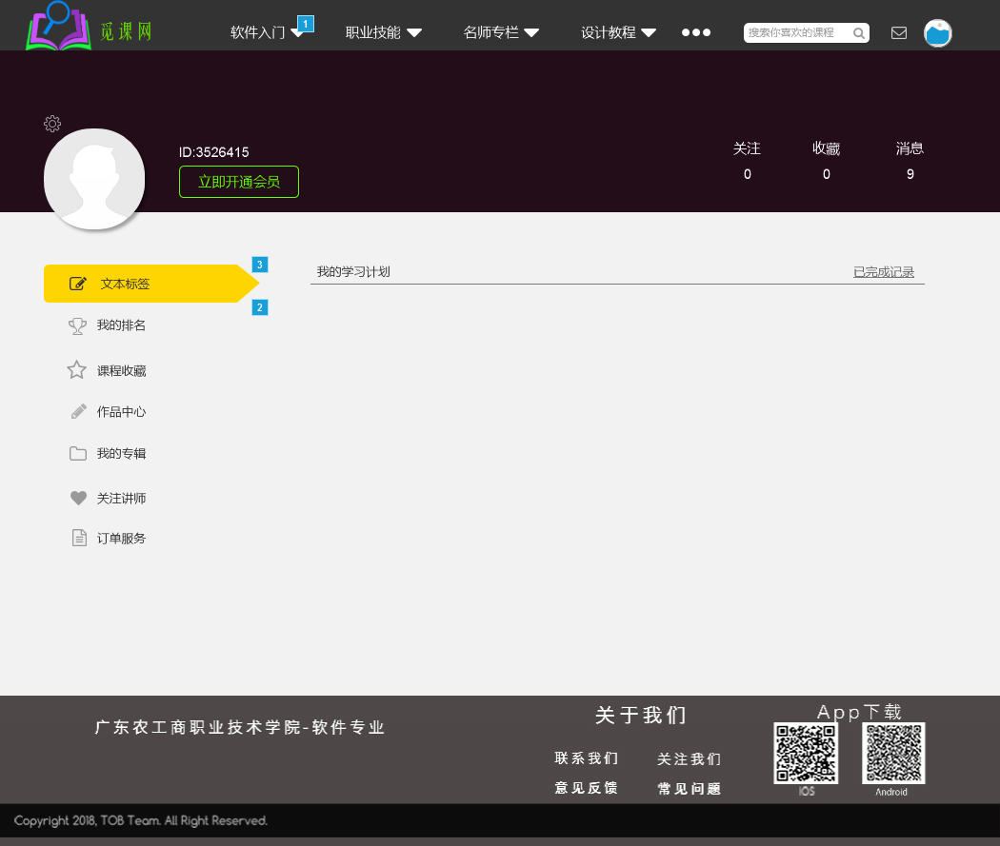
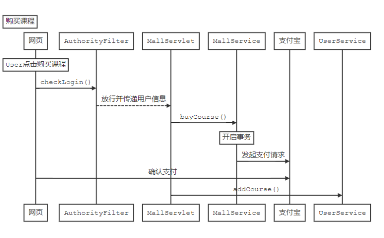
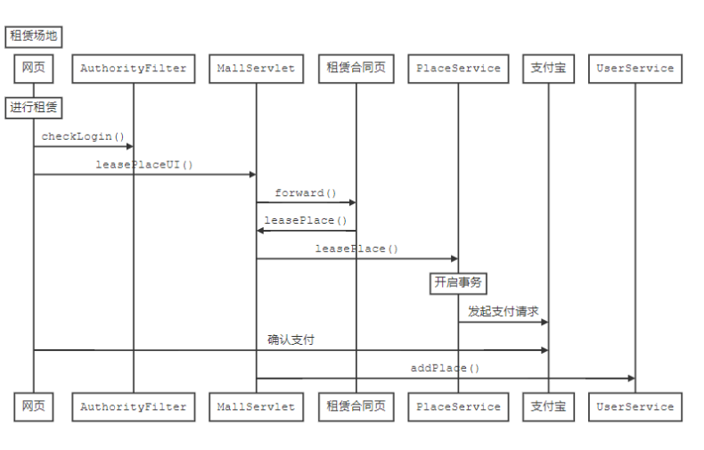
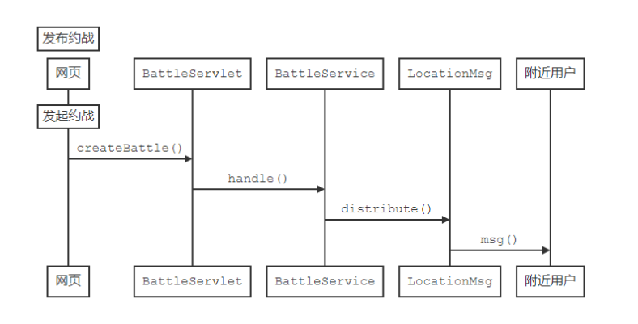

# 1 简介

## 1.1 背景

​	在当今的教育模式下，人们想学习新的课外知识时，愁于难以找到一个可以适合自己的老师。原因之一是途径少，想找一个适合自己的老师，有时宛如大海捞针。并且每个人要学的内容并不相同，当前市面上培训机构培训的内容也有限，不能很好地满足所有人的时需所以想要找到一个可以合适的、有资质的老师就显得困难。即使学生找到了合适的老师，也因时间问题或者场地问题无法满足教学条件。另一方面，很多时候老师想在课余时间找兼职、找职位却困于没途径。

​	针对诸如此类的问题，我们团队利用互联网+的全球性和普遍性，创立了觅课网——线上订课线下授课的教育型WEB应用系统。

​	此平台与广大慕课平台（网上授课平台）相比优势在于，其他平台基本都是仅面向线上教育，而且内容偏向理论的。但在体育，烹饪，工程，计算机，职业技能等大类学科中就不仅需要理论知识，还需要大量实践，才能有较好效果。

​	觅课网结合了线上和线下教育的优点，直视了线下教育的弊端。其特点是1.线上订课，可以补足资源不足的问题。2.线下授课，可以补足线上重理论轻实践的问题。3.场地租赁，减轻教师错时失地的问题。觅课网团队一致认为专注改良教育环境条件和师资条件的任务是不可怠慢的任务。

## 1.2 目的

​	本项目涵盖了市场上一般的网上授课资源，给学生和老师提供了一个便利的，可以相互学习的平台，学生可以在这里学习到新的知识和技能，老师可以在这里做兼职。在此平台上，学生如果有时间又想学习的话，可以在这里查找适合自己的老师，学生通过预约老师，老师接单，实现线上或者线下教学，有效的缓解了学生想学但又没人教的尴尬局面，使人们能学习到想学习的知识，为实现全面发展提供了一个学习平台。 

## 1.3 范围

​	C&C不单可以使在校学生学习到想学的知识，只要想学都可以在平台上找到自己想要学习的内容，包含各行各业的知识，你都能在这找到相关方面的人才教你知识。

# 2 软件概述

## 2.1 前景分析

​	随着经济的快速发展，对各行各业人才的需求越来越大，人们渴望通过学习来学习相关知识，所以我们团队想出这个项目，来解决这个局面，觅课网平台同其他平台对比，不仅提供了网上教学授课，还发明了线下面对面授课的方式。学生可以在空闲想学习的时候，在此平台预约老师，预约学习的时间和地点，老师接单后，实现面对面教学。即解决学生想学习但又找不到老师的尴尬局面，也解决了老师课余时间想找兼职难的问题。

## 2.2 产品环境介绍 

### 2.2.1 产品特征

1. 纯B/S应用：用户不需要装任何客户端，只要一台电脑，一根网线，任何时间，任何地点都能通过主流浏览器轻松登录。用户界面为纯浏览器WEB客户端。WEB服务器为Apache+tomcat，数据库使用Mysql。
2. AOP架构：面向切面AOP设计，扩展简单，提高开发速度，降低总体成本，降低IT建设风险，提高投资回报率，保护IT资产。
3. SPA应用：单页面应用，不出现任何链接跳转，不出现任何闪屏，连续画面带来顺滑流畅的用户体验。
4. 完全支持unicode：可以让产品在各种语种的操作系统和设备上运行，客户端可以在主流浏览器的轻松浏览，或是轻松切换到简体中文、繁体中文、英文语言。WebServer和AppServer都可以在简体中文、繁体中文、英文环境中都正常使用。
5. 将适配移动端，产品将在后续开发中适配移动端的，移动端UI和布局跟PC的不一样，但功能齐全，规律可循。

### 2.2.2 产品软、硬件环境

| 部署类型 | 配置项    | 软件版本                                                     |
| -------- | --------- | ------------------------------------------------------------ |
| 客户端   | 操作系统  | windows XP、windows vista、windows7、windows8、windows8.1、windows 10 |
|          | 浏览器    | ie9.0以上，firefox34以上，Chrome45以上，Edge12以上、Opera32以上、Safari9以上 |
| 服务器   | 操作系统  | windows server2003，windows server2008，Centos，Ubuntu       |
|          | 运行库    | 无                                                           |
|          | WebServer | Apache或nginx                                                |

|          | 数据库    | Mysql                                                        |# 3 软件需求

## 3.1 功能概要

1. 新用户注册
2. 密码找回
3. 提升资格申请
4. 场地租赁
5. 发布课程
6. 图片分享
7. 课程评论
8. 约战功能
9. 黑名单、可靠度管理

## 3.2非功能性需求

1. 按照antd十大原则设计界面，要求美观，风格统一。
2. 参考各大流行ui框架，追求完美的客户体验
3. 按照“自然”，"确定"原则，追求交互性良好，功能方便。

# 4  概要设计

## 4.1 功能需求

### 4.1.1 用户管理模块

​	用户注册：用户通过输入用户名、密码、邮箱后提交，格式符合要求且没有与数据库的其他用户信息重复则注册成功。

​	用户登录：用户根据注册的用户名、密码进行登录，登录成功会更新用户所在的地理位置。

​	用户找回密码：注册时通过的邮箱认证功能，忘记密码或掉失时，可以申请找回密码，发邮件到注册邮箱进行密码修改。

​	教师（场所租赁员）资格申请：普通用户填写教师（场所租赁员）资格申请表，在5个工作日内，会有网站管理工作人员联系用户，进行电访评定及资格申请表核实后，普通用户提升为教师用户（场所租赁员）

### 4.1.2 课程管理模块

​	创建课程：教师用户可在后台的课程中心进行课程的创建，经管理员审查后上线发布。

​	课程克隆：教师在第二次开课，可直接在课程中再次开课，并且上次课程记录不会被覆盖。

### 4.1.3 租赁管理模块

​	创建场地：场地租赁员在后台场所中心进行场所的创建，经管理员审核查验后上线发布。

​	场所租赁信息更新：场地租赁员在场所部分信息（如：价格，设施等）变更后需及时更改场所消息，保证场地消息的准确性。

### 4.1.4 查找管理模块

​	定位功能：采用了高德SDK的定位服务，用户在后台的场所中心可看到附近的场所，场所按照网站统计热度进行排序。

​	查找附近的人：用户可以在附近的人界面发布约战PK，附近的用户在附近的人界面就能看到约战单。

### 4.1.5 购课管理模块

​	购课车功能：用户选择课程后将会保存到购课车，最后可在购课车中统一付款。在购课车中的课程在打折后，将会发送手机短信至用户预留手机号上，让用户第一时间收到优惠消息。

### 4.1.6分享管理模块

​	分享课程及图片：用户参加课程后，可分享课程及图片到自己的分享中。也可以通过QQ、微信、微博进行分享。

​	评论课程：用户在参加完课程后，可在课程界面中对课程进行评论，并需要提供一些照片来保证评论的真实性。

​	举报：当评论或分享中出现违法、传播不良信息的情况，用户可以进行举报反馈，确认该用户情况属实，系统将进行警告或者封号处理。

### 4.1.7约战管理模块

​	用户约战：用户在附近的人界面点击约战单预约约战，用户约战完后，互扫二维码以完成约战，并对约战对象进行评分与评论，用户不得对评论和评分进行屏蔽；若用户无故失约，对方可将其拉至黑名单，被拉黑人无法看到对方的约战单。

### 4.1.8 黑名单管理模块

​	用户黑名单：用户将不守约或发表违法、传播不良信息的用户拉入黑名单，将不会再看到该用户的任何消息，也不会被对方看到自己的信息。

## 4.2 数据库概要设计

​	数据库的设计主要有用户表(cnc_user)、课程表(cnc_course)、场所表(cnc_place)。详细设计请查看模块详细设计的数据库设计。

## 4.3 性能需求

可以容纳100的并发数量以上

## 4.4 外部接口需求

以移动版为例：

| 第三方登录: | 第三方分享           | 第三方验证            | 第三方地图 |
| ----------- | -------------------- | --------------------- | ---------- |
| 腾讯        | 微信朋友圈，微信好友 | mob公司的手机短信验证 | 高德地图   |
| 微信        | 腾讯空间、QQ好友     |                       | 高德定位   |
| 微博        | 微博分享             |                       |            |

# 5 软件质量特性

## 5.1 可移植性

觅课网使用B/S架构，其中B指browser，为浏览器；S指server，为服务器。并且采用前后端分离的方式进行开发。

B/S架构具备通用性，无论是window、linux、macOS还是移动端，都能达到用户体验基本一致。对比起C/S架构的应用，这个架构的优势在于更新界面或是功能时，不需要通知用户重新下载软件本身，只需在后台发布更新，即可对用户界面与功能的新增与修改。

前后端分离是指将前端界面开发和后台数据传输分开，一方面，达到前端开发不干扰到后台，两边同时进行开发，从以前的重复开发变成分离开发，提高了编码速度。一方面，它更容易支撑起日渐膨胀的需求变化，比如当后台开发完成后，对界面不满意时，界面是可以轻松替换的；这个道理反过来也是适用，比如对后台的性能不满意时，只要按照接口规范输出，不管后台怎么重构整个服务器，对前端界面也是没有太大影响的。

通过前后端分离技术设计应用，才能充分发挥b/s架构应用的可移植性。

​	

## 5.2 易用性

网站初次进入时，会给新到用户播放一遍一个简短的使用方式漫游探索，告诉用户怎么操作，主要目的是邀请用户，让用户大胆试的机会，降低用户初次使用的陌生感。

# 6 数据库设计

## 6.1 数据字典

| 字段名   | 类型       | 长度   | 描述                        |
| -------- | ---------- | :----- | --------------------------- |
| 编号     | bigint     | 11     | 通用字段标识符              |
| 短编号   | int        | 4      |                             |
| 订单号   | varcahr    | 20     | 前面是标识符，后面是时间    |
| 名称     | varchar    | 50     | 书名，课程名，文章标题      |
| 短名称   | varchar    | 18     | 学校、企业名称，昵称，姓名  |
| 超短名称 | varchar    | 8      | 角色名                      |
| 单字变量 | varchar    | 1      | 性别（男、女）布尔值（Y,N） |
| 密码     | varchar    | 32     | 密文密码                    |
| 普通描述 | varchar    | 240    | 课程简述，课程预览文        |
| 简短描述 | varchar    | 120    | 个人简介，个人签名          |
| 头像     | mediumblob | 1      | 存储头像，最大128kb         |
| 海报     | mediumblob | 1      | 储存海报，最大2mb           |
| 金钱     | decimal    | (20,3) | 精确到分                    |
| 人数     | int        | 4      |                             |
| 时间     | datetime   | 1      | 开始时间，结束时间          |
| 邮箱     | varchar    | 32     | 各种带@符号的邮箱地址       |
| 评分     | decimal    | (1,2)  | 0-5之间带2位小数点          |
| 省市县   | varchar    | 4      |                             |
| 详细地址 | varchar    | 32     |                             |

## 6.2 课程表(cnc_course)

| 字段名     | 类型     | 描述             |
| ---------- | -------- | ---------------- |
| id         | 编号     |                  |
| status     | 短编号   | 连接到课程状态表 |
| poster     | 海报     |                  |
| type       | 短编号   | 连接到课程分类表 |
| price      | 金钱     |                  |
| max_person | 人数     |                  |
| overview   | 普通描述 |                  |
| teaid      | 编号     | 连接到用户表     |
| name       | 名称     |                  |
| created    | 时间     | 创建课程时间     |
| started    | 时间     | 开始报名时间     |
| ended      | 时间     | 结束报名时间     |

## 6.3 用户表(cnc_user)

| 字段名    | 类型     | 描述          |
| --------- | -------- | ------------- |
| id        | 编号     |               |
| username  | 名称     | 用于登录      |
| nickname  | 名称     | 用于外部显示  |
| email     | 邮箱     | 用于重置密码  |
| sex       | 单字变量 | 只能是男或女  |
| password  | 密码     | 是密文        |
| signature | 简短描述 | 不带html代码  |
| avatar    | 头像     | 最大大小128kb |
| role_id   | 短编号   | 连接到角色表  |

## 6.4 场所表(cnc_place)

| 字段       | 类型     | 描述           |
| ---------- | -------- | -------------- |
| id         | 编号     |                |
| rentable   | 单字变量 |                |
| province   | 省市县   | 省（不带省字） |
| city       | 省市县   | 市（不带市字） |
| county     | 省市县   | 县（不带县字） |
| address    | 详细地址 |                |
| manager_id | 编号     | 连接到用户表   |

## 6.5 订单表(cnc_payment)

| 字段        | 类型   | 描述                     |
| ----------- | ------ | ------------------------ |
| serial      | 订单号 | 前面是标识符，后面是日期 |
| total_price | 金钱   |                          |
| uid         | 编号   |                          |
| mid         | 编号   |                          |

## 6.6  角色表(cnc_role)

| 字段 | 类型     | 描述 |
| ---- | -------- | ---- |
| id   | 短编号   |      |
| name | 超短名称 |      |

## 6.7  评分表(cnc_rate)

| 字段 | 类型 | 描述 |
| ---- | ---- | ---- |
| cid  | 编号 |      |
| uid  | 编号 |      |
| rate | 评分 |      |

## 7 详细设计

### 7.1 关键时序设计

#### 7.1.1 用户购买课程时序图说明：

​	用户购买课程时，首先系统会对用户进行登录检查，未登录用户跳转至登录界面执行登录，已登录用户会通过支付宝接口，跳转到支付宝页面，进行支付宝的付款流程，最终确认支付后系统会将课程添加到用户课程表里，用户即可在个人中心的”我的课程“中查看刚刚购买的课程。

#### 7.1.2 场地租赁时序图说明：

​	用户在进行场地租赁的时候，首先会被系统检验登录信息，通过检验后服务器会对其进行页面转发到租赁合同页，确定合同没问题后，跳转至支付宝进行支付定金，完成后场地租赁员会在3个工作日内联系用户，签订合同后，按月支付租赁费用，直到合同过期。

#### 7.1.3 发布约战时序图说明：

​	用户在个人中心选择一个场地位置，填写约战单进行发布约战信息，系统通过处理后转存到数据库中，并调用区域消息系统，对附近同城用户进行消息分发，让其他用户接受到约战单，约战单在到约战时间前一个小时内无法取消。

